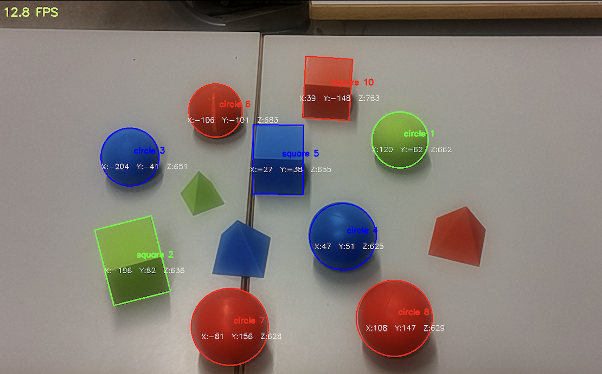
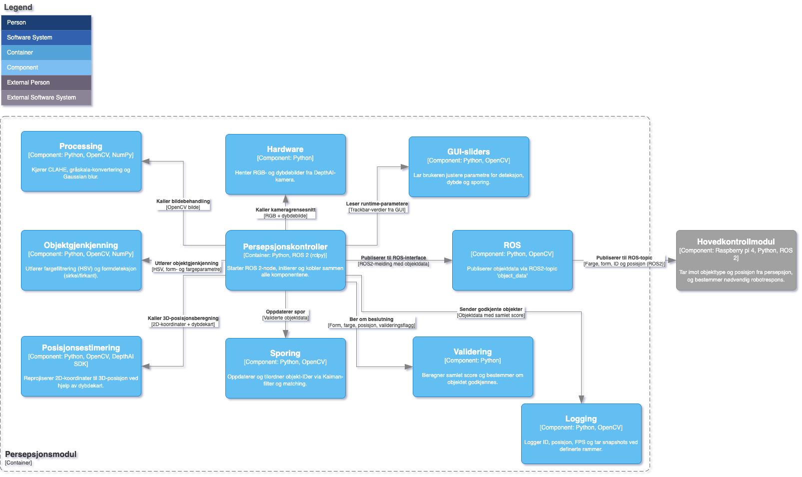
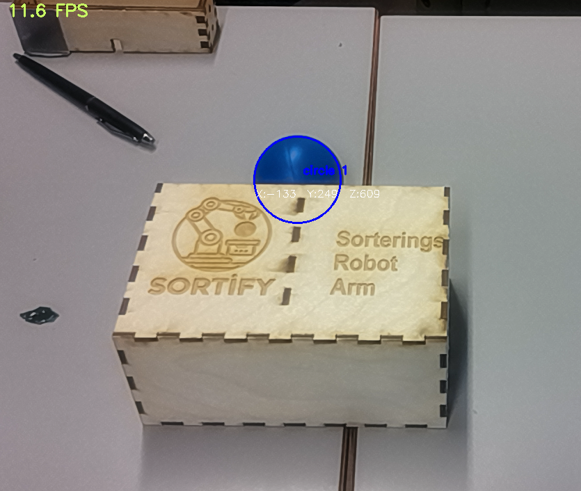
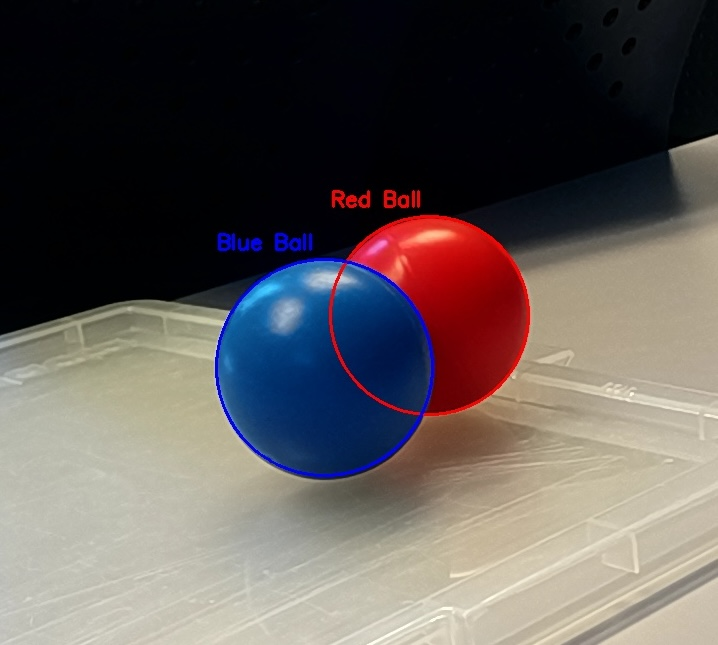
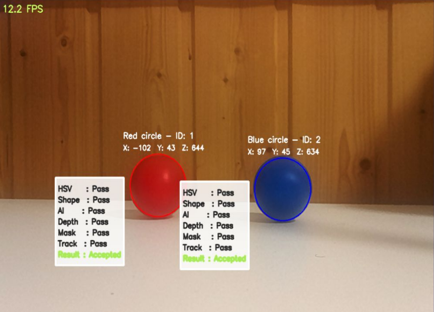

# Sortify Perception Module


*Detection output with three red balls, two blue balls, a green ball, blue/red/green squares—all with coordinates and IDs. Pyramids used as negative controls, not detected by the system.*

Real-time computer vision module for object detection and tracking, used in robotic sorting and safety systems. Supports classic CV and YOLOv4-tiny verification, with modular output for ROS2 or UDP pipelines.


## Demo with Red and Blue Ball

https://youtu.be/h6cor_CGYTA


## Features

- Real-time shape and color detection using OpenCV  
- YOLOv4-tiny model support for AI-based verification (optional)  
- Modular mode switch: `sortify`, `demo`, or `safety`  
- HSV trackbar tuning, detection overlays, scoring & decision logic  
- ROS2 publisher (Sortify mode) or UDP signaling (Safety mode)  
- Flexible input: DepthAI, webcam, or UDP-streamed frames  


## How to Run

1. Clone the repository:
   ```bash
   git clone https://github.com/your-username/SortifyPerceptionModule.git
   cd SortifyPerceptionModule
   ```

2. Install dependencies:
   ```bash
   pip install -r requirements.txt
   ```

3. Configure `config.py`:
   - Set `MODE = "sortify"` for ROS2 + DepthAI
   - Set `MODE = "demo"` for webcam mode (e.g., iPhone camera)
   - Set `MODE = "safety"` for Unity UDP vest detection

4. Run the controller:
   ```bash
   python perception_controller.py
   ```


## Repo Structure

```
SortifyPerceptionModule/
├── config.py
├── perception_controller.py
├── detection/                # Shape, color, AI-based detection logic
├── hardware/                 # DepthAI camera support
├── preprocessing/            # Frame enhancement, CLAHE, blur, etc.
├── scoring_controller/       # Decision logic, scoring model
├── shape_tracker/            # Per-object tracking system
├── ros_wrapper/              # ROS2 publishing interface
├── gui_interface.py          # HSV slider config and runtime param readout
├── yolo_verification.py      # YOLOv4-tiny inference wrapper
└── logging_handler.py        # Optional logging for evaluation/analysis
```


## System Architecture


*Module-level diagram*


## Robustness Examples



*Robust detection even under major occlusion (blue ball at 50% coverage).*



*System with partial overlap, maintaining detection for distinct objects.*


## Detection & Decision Logic



*Live debug overlay shows HSV, shape, AI, depth, mask, and track passes. Final acceptance decision displayed for each detected object.*


## Originally made for this Rig

  
*Deployed on a 5-DOF robot arm using an OAK-D S2 (DepthAI) camera. Used with this rig at USN Expo.*


## Used in Other Projects

This module is directly integrated into:  
- [RobotSafetySystem](https://github.com/azichi/projecthub/RobotSafetySystem)

It handles all perception and vest detection logic via UDP.
